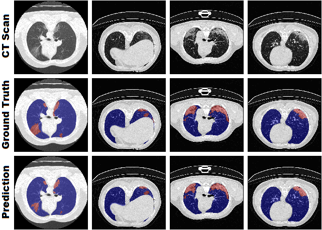
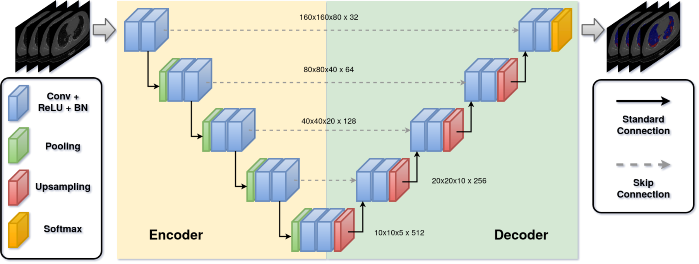
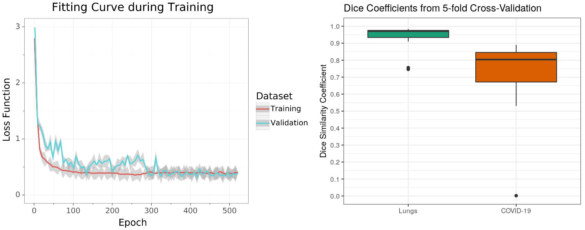

# Robust Chest CT Image Segmentation of COVID-19 Lung Infection based on limited data

[](https://doi.org/10.5281/zenodo.3902293)

In this paper, we proposed and evaluated an approach for automated segmentation of COVID-19 infected regions in CT volumes. Our method focused on on-the-fly generation of unique and random image patches for training by exploiting heavy preprocessing and extensive data augmentation. Thus, it is possible to handle limited dataset sizes which act as variant database. Instead of new and complex neural network architectures, we utilized the standard 3D U-Net. We proved that our medical image segmentation pipeline is able to successfully train accurate as well as robust models without overfitting on limited data.
Furthermore, we were able to outperform current state-of-the-art semantic segmentation approaches for lungs and COVID-19 infection. Our work has great potential to be applied as a clinical decision support system for COVID-19 quantitative assessment and disease monitoring in the clinical environment. Nevertheless, further research is needed on COVID-19 semantic segmentation in clinical studies for evaluating clinical performance and robustness.

The models, predictions, visualizations and evaluation (scores, figures) are available under the following link: https://doi.org/10.5281/zenodo.3902293

**This work does NOT claim clinical performance in any means and underlie purely educational purposes.**



## Reproducibility

**Requirements:**
- Ubuntu 18.04
- Python 3.6
- NVIDIA QUADRO RTX 6000 or a GPU with equivalent performance

**Step-by-Step workflow:**

Download the code repository via git clone to your disk. Afterwards, install all required dependencies, download the dataset and setup the file structure.

```sh
git clone https://github.com/muellerdo/covid19.MIScnn.git
cd covid19.MIScnn/

pip3 install -r requirements.txt
python3 scripts/download_data.py
```

Optionally, you can run the data exploration, which give some interesting information about the dataset.

```sh
python3 scripts/data_exploration.py
```

For the training and inference process, you initialize the cross-validation folds by running the preprocessing. This setups a validation file structure and randomly samples the folds.

The most important step is running the training & inference process for each fold. This can be done either sequential or parallized on multiple GPUs.

```sh
python3 scripts/run_preprocessing.py
python3 scripts/run_miscnn.py --fold 0
python3 scripts/run_miscnn.py --fold 1
python3 scripts/run_miscnn.py --fold 2
python3 scripts/run_miscnn.py --fold 3
python3 scripts/run_miscnn.py --fold 4
```

Finally, the evaluation script computes all scores, visualizations and figures.

```sh
python3 scripts/run_evaluation.py
```

## Materials / Dataset

We used the public dataset from Ma et al. which consists of 20 annotated COVID-19 chest CT volumes⁠. Currently, this dataset is the only publicly available 3D volume set with annotated COVID-19 infection segmentation⁠. Each CT volume was first labeled by junior annotators, then refined by two radiologists with 5 years of experience and afterwards the annotations verified by senior radiologists with more than 10 years of experience⁠. The CT images were labeled into four classes: Background, lung left, lung right and COVID-19 infection.

Reference: https://zenodo.org/record/3757476#.XqhRp_lS-5D

## Methods

The implemented medical image segmentation pipeline can be summarized in the following core steps:
- Dataset: 20x COVID-19 CT volumes
- Limited dataset → Utilization as variation database
- Heavy preprocessing methods
- Extensive data augmentation
- Patchwise analysis of high-resolution images
- Utilization of the standard 3D U-Net
- Model fitting based on Tversky index & cross-entropy
- Model predictions on overlapping patches
- 5-fold cross-validation via Dice similarity coefficient



This pipeline was based on MIScnn⁠, which is an in-house developed open-source framework to setup complete medical image segmentation pipelines with convolutional neural networks and deep learning models on top of Tensorflow/Keras⁠. The framework supports extensive preprocessing, data augmentation, state-of-the-art deep learning models and diverse evaluation techniques. The experiment was performed on a Nvidia Quadro P6000.

MIScnn: https://github.com/frankkramer-lab/MIScnn

## Results & Discussion

Through validation monitoring during the training,
no overfitting was observed. The training and validation
loss function revealed no significant distinction from each
other. During the fitting, the
performance settled down at a loss of around 0.383 which is
a generalized DSC (average of all class-wise DSCs) of
around 0.919. Because of this robust training process
without any signs of overfitting, we concluded that fitting
on randomly generated patches via extensive data
augmentation and random cropping from a variant database,
is highly efficient for limited imaging data.



The inference revealed a strong segmentation performance for lungs, as well as, COVID-19 infected regions. Overall, the
cross-validation models achieved a DSC of around 0.956 for lung and 0.761 for COVID-19 infection segmentation.  
Furthermore, the models achieved a sensitivity and
specificity of 0.956 and 0.998 for lungs, as well as, 0.730
and 0.999 for infection, respectively.

Nevertheless, our medical image
segmentation pipeline allowed fitting a model which is able
to segment COVID-19 infection with state-of-the-art
accuracy that is comparable to models trained on large
datasets.

## Author

Dominik Müller  
Email: dominik.mueller@informatik.uni-augsburg.de  
IT-Infrastructure for Translational Medical Research  
University Augsburg  
Bavaria, Germany

## How to cite / More information

Dominik Müller, Iñaki Soto-Rey and Frank Kramer.  
Robust chest CT image segmentation of COVID-19 lung infection based on limited data.  
Informatics in Medicine Unlocked. Volume 25, 2021.  
DOI: https://doi.org/10.1016/j.imu.2021.100681

```
@article{MULLER2021100681,
title = {Robust chest CT image segmentation of COVID-19 lung infection based on limited data},
journal = {Informatics in Medicine Unlocked},
volume = {25},
pages = {100681},
year = {2021},
issn = {2352-9148},
doi = {https://doi.org/10.1016/j.imu.2021.100681},
url = {https://www.sciencedirect.com/science/article/pii/S2352914821001660},
author = {Dominik Müller and Iñaki Soto-Rey and Frank Kramer},
keywords = {COVID-19, Segmentation, Limited data, Computed tomography, Deep learning, Artificial intelligence},
eprint={2007.04774},
archivePrefix={arXiv},
primaryClass={eess.IV}
}
```

Thank you for citing our work.

## License

This project is licensed under the GNU GENERAL PUBLIC LICENSE Version 3.  
See the LICENSE.md file for license rights and limitations.
